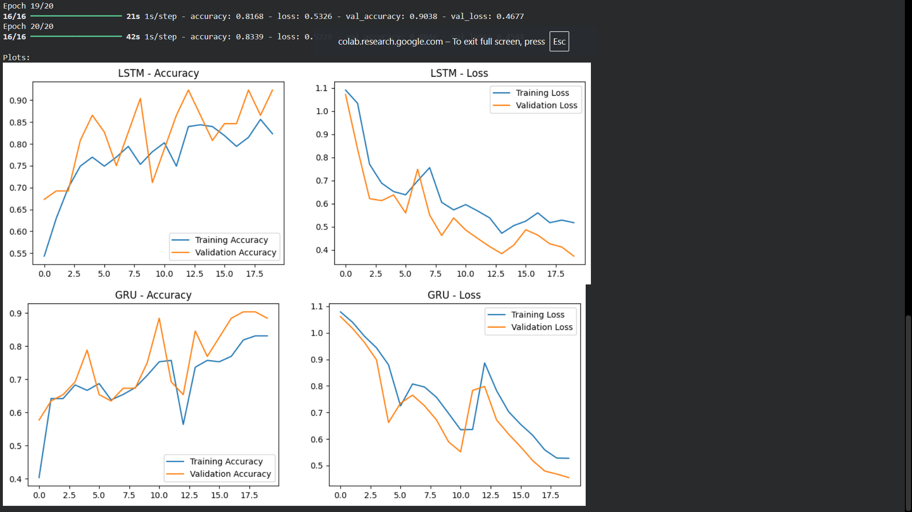
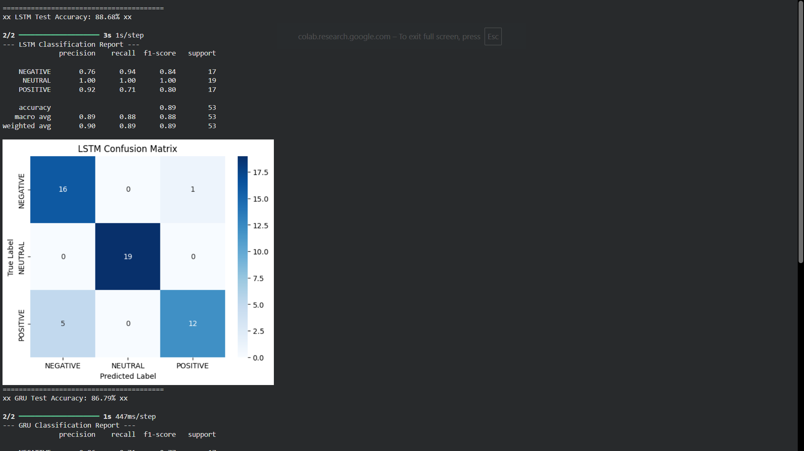
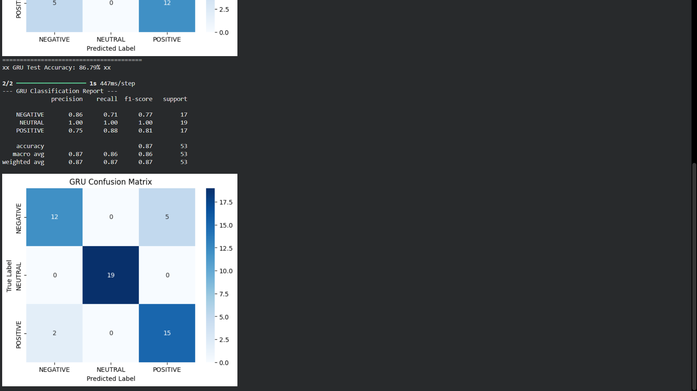

# EEG-Emotion-Recognition
A comparative study of LSTM and GRU networks for classifying human emotions from EEG signals. Developed as a final project for the ANN course.


# 🧠 EEG Emotion Recognition using Deep Learning (LSTM vs GRU)


## 📌 Project Overview

The goal is to build and compare two Recurrent Neural Network (RNN) architectures—**Long Short-Term Memory (LSTM)** and **Gated Recurrent Units (GRU)**—to classify human emotions based on **EEG (Electroencephalography)** signals. The system classifies brain signals into three distinct emotional states:
1.  **NEGATIVE**
2.  **NEUTRAL**
3.  **POSITIVE**

## 📂 Dataset
* **Source:** `emotions.csv`
* **Structure:** Time-series data derived from EEG recordings.
* **Features:** **2,548** numerical features per sample (treated as time-steps).
* **Labels:** 3 Categorical classes (Negative, Neutral, Positive).
* **Preprocessing:** * Missing values (NaNs) were removed.
    * Labels were encoded (0, 1, 2).
    * Features were scaled using `StandardScaler`.

## ⚙️ Methodology & Pipeline

### 1. Data Preprocessing
Since LSTM and GRU models require 3D input, the data was reshaped to simulate a time-series sequence:
* **Input Shape:** `(Batch_Size, Timesteps, 1)` where `Timesteps = 2548`.
* **Splitting:** The dataset was split into **70% Training**, **15% Validation**, and **15% Testing** using stratified sampling.

### 2. Model Architectures
Both models were designed with similar complexity for a fair comparison:

| Layer | LSTM Model | GRU Model |
| :--- | :--- | :--- |
| **Input** | (2548, 1) | (2548, 1) |
| **Recurrent Layer** | LSTM (64 units) | GRU (64 units) |
| **Regularization** | Dropout (0.3) | Dropout (0.3) |
| **Dense Layer** | Dense (32, ReLU) | Dense (32, ReLU) |
| **Output** | Dense (3, Softmax) | Dense (3, Softmax) |

* **Optimizer:** Adam
* **Loss Function:** Sparse Categorical Crossentropy
* **Epochs:** 20 (Optimal point to avoid overfitting)

## 📊 Results & Evaluation

Both models achieved high accuracy, with **LSTM slightly outperforming GRU** on this specific dataset.

| Metric | LSTM Model 🏆 | GRU Model |
| :--- | :---: | :---: |
| **Test Accuracy** | **88.68%** | 86.79% |
| **Neutral Class Precision** | **100%** | 100% |

### 📉 Learning Curves
*Both models showed stable convergence. Training was stopped at 20 epochs to prevent overfitting.*



### 🟦 Confusion Matrices
*The models perfectly classified "Neutral" emotions. Minor confusion occurred between "Positive" and "Negative" states due to similar arousal levels.*

| LSTM Model (88.68%) | GRU Model (86.79%) |
| :---: | :---: |
|  |  |

## 🚀 How to Run
1.  Clone the repository:
    ```bash
    git clone [https://github.com/ziadanasshokry/EEG-Emotion-Recognition.git](https://github.com/ziadanasshokry/EEG-Emotion-Recognition.git)
    ```
2.  Install dependencies:
    ```bash
    pip install pandas numpy matplotlib seaborn tensorflow scikit-learn
    ```
3.  Run the Jupyter Notebook:
    ```bash
    jupyter notebook "ANN Final Project.ipynb"
    ```

## 📝 Conclusion
* **LSTM** proved to be slightly more effective for this long-sequence EEG data (2548 steps) compared to GRU.
* The system successfully identifies "Neutral" states with **100% accuracy**.
* **Future Work:** Implementing **Bidirectional LSTM** and **Attention Mechanisms** could further improve the distinction between Positive and Negative emotions.


* **Ziad Anas**
